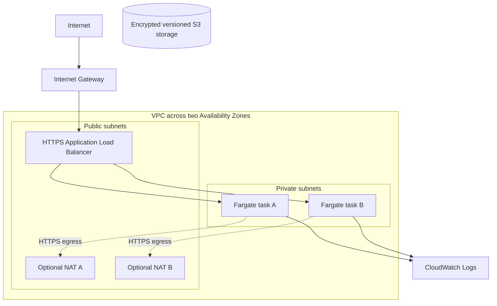

# Terraform AWS Production Environment

[](https://github.com/German4341374/terraform-aws-production-environment/actions/workflows/terraform.yml)

Terraform files for an AWS app setup with public and private subnets, a load balancer,
containers, and encrypted storage. You can read the plans, run the tests with a mocked
provider, and check the configuration without an AWS account.

The runtime resources are turned off by default. Deploying the real setup costs money,
so review the plan and cost warning before enabling them.

> **Cost warning:** A real apply can create charged NAT Gateways, an Application Load Balancer,
> Fargate tasks, CloudWatch logs, S3 storage, and data transfer. Runtime and NAT resources are
> disabled by default. Never apply before reviewing a plan and cost estimate.

## Architecture



## Technology stack

- Terraform 1.15.8; AWS provider 6.54.0
- VPC, two public/private subnet pairs, route tables, IGW, optional HA NAT
- HTTPS ALB, ECS Fargate, Application Auto Scaling, security groups
- AES-256 encrypted/versioned S3 and CloudWatch logs
- Terraform tests with mocked AWS, TFLint 0.63.1, Trivy Config 0.72.0
- Optional open-source Infracost workflow

## Architecture choices and trade-offs

- **Two AZs:** tolerates one-AZ failure, but doubles NAT cost when private egress is enabled.
- **Private Fargate tasks:** no public IPs; image pulls require NAT or carefully designed VPC endpoints.
- **HTTPS-only ALB:** requires a real ACM certificate; HTTP is not opened.
- **Fargate:** removes host patching but costs more than well-utilized EC2 in some workloads.
- **SSE-S3 storage:** encrypted without a paid customer KMS key; KMS offers stronger key control at cost.
- **Runtime off by default:** modules/resources are validated while paid ALB/NAT/Fargate remain absent.

## Prerequisites

For safe local validation on Linux or WSL2: Terraform 1.8+, TFLint, Trivy, Bash,
and Make. AWS CLI and credentials are not required. Real deployment additionally requires your own
AWS account, short-lived authenticated session, ACM certificate, permissions, and budget controls.

## Safe local validation

```bash
make setup
make fmt
make validate
make test
make lint
```

`terraform init -backend=false` avoids remote-state access. `terraform test` uses a mocked AWS
provider and verifies safe defaults, four subnets, runtime preconditions, and production shape.

## Real deployment workflow

Do not deploy fake examples unchanged. Copy files outside Git, authenticate with short-lived SSO,
configure a protected state bucket, and obtain a real ACM certificate. Then:

```bash
terraform init -reconfigure -backend-config=backend.hcl
bash scripts/plan.sh production.auto.tfvars
# Review production-plan.txt and optional Infracost output.
bash scripts/apply.sh
```

No GitHub workflow applies infrastructure. `apply.sh` requires typing `APPLY-PAID-AWS`.

## Remote state and locking

`backend.hcl.example` demonstrates encrypted S3 state with native S3 lock files. The bucket must be
created separately with versioning, encryption, public-access blocking, and tightly scoped IAM.
Locking prevents concurrent writers; versioning supports recovery from accidental state changes.
State can contain secrets and infrastructure data even when outputs are marked sensitive. Never commit it.

## IAM least privilege

The ECS execution role can only create/write streams in its application log group. The task role has
no permissions because the sample application calls no AWS APIs. ECR, S3, or Secrets Manager access
should be added as separate resource-scoped statements only when the workload needs them. Humans and
CI should use short-lived federation, not access keys.

## Network flow

1. Internet traffic reaches the IGW and public HTTPS ALB.
2. ALB security group accepts TCP 443; it can send only container-port traffic to the task SG.
3. Tasks run in private subnets without public IPs and accept traffic only from the ALB SG.
4. Task HTTPS egress uses same-AZ NAT gateways when enabled.
5. Application logs and production VPC Flow Logs go to CloudWatch; PostgreSQL/database services are not included.

## CI and cost estimation

Static CI has `contents: read`, no AWS credentials, no plan against an account, and no apply. It runs
fmt, validate, mocked tests, TFLint, and Trivy Config. The optional manual Infracost workflow runs only when
an `INFRACOST_API_KEY` repository secret is configured; otherwise it exits safely with an explanation.
Infracost estimates are guidance, not invoices.

## Destroy instructions

Review a destroy plan first and confirm retention requirements. Then run `bash scripts/destroy.sh` and
type `DESTROY-PAID-AWS`. The script explicitly disables ALB deletion protection before destroy.
Non-empty protected storage and state infrastructure may intentionally remain.
Verify the AWS console, Cost Explorer, EIPs, NAT gateways, ALBs, log groups, and buckets afterward.

## Troubleshooting

- Backend prompts during validation: use `terraform init -backend=false`.
- Credential errors in safe mode: remove real plan commands; mocked tests need no credentials.
- Runtime precondition fails: runtime requires NAT gateways and a real ACM certificate ARN.
- Fargate cannot pull image: verify private routes, NAT health, DNS, and task execution requirements.
- Destroy fails on S3: preserve data or explicitly empty it only after approval.

## Security considerations

HTTPS-only ingress, private tasks, SG-to-SG rules, no public task IPs, read-only container filesystem,
scoped IAM, encrypted storage, versioning, log retention, container insights, and no committed keys.
See `docs/threat-model.md` for threats, controls, residual risks, and trust boundaries.

## Limitations

- No real AWS plan/apply was run; static mock validation cannot prove quotas or account policies.
- No WAF, Shield Advanced, Route 53, database, secrets service, backups, or cross-region recovery.
- ALB access logging and WAF are documented extensions; related scanner trade-offs are documented beside the resources.
- Example account IDs and ARNs are fake.

## Next infrastructure exercises

Add WAF, VPC endpoints, KMS customer keys, ALB logs, private ECR, Secrets Manager, database module,
AWS Config, GuardDuty, backup policies, signed images, and OIDC-based deployment workflows with approvals.

## Design questions

- Public ALB/private task flow and SG referencing.
- HA versus NAT cost and VPC endpoint alternatives.
- Execution role versus task role.
- Why state locking/versioning and short-lived identity matter.
- Why static CI never implies deployment safety.

See `DEMO.md`, `docs/design-notes.md`, ADRs, runbooks, and the threat model.

## License

MIT. See `LICENSE`.
